# Entity Relationship Diagram (ERD) — neXt TMS

This is a frontend-side reference to the data model exposed by the neXt TMS
API. The authoritative schema lives in `backend-nextms/docs/ERD.md` — the
Sequelize models in `backend-nextms/src/models/` are the source of truth.

Every entity below corresponds to an API module under
[`src/api/`](../src/api/):

| Domain             | Frontend API module                                                                |
|--------------------|------------------------------------------------------------------------------------|
| Auth / Identity    | `auth.api.js`, `organizations.api.js`                                              |
| Fleet              | `drivers.api.js`, `trucks.api.js`, `trailers.api.js`, `compliance.api.js`          |
| Operations         | `loads.api.js`, `dispatch.api.js`, `brokers.api.js`, `facilities.api.js`           |
| Billing            | `billing.api.js`                                                                   |
| Fuel               | `fuel.api.js`                                                                      |
| Expenses           | `expenses.api.js`                                                                  |
| AVA AI Mechanic    | `ava.api.js`                                                                       |
| Agent Platform     | `agents.api.js`                                                                    |
| ATLAS              | `atlas.api.js`                                                                     |
| Driver Portal      | `driverPortal.api.js`, `driverConnection.api.js`, `driverSettings.api.js`          |
| P&L / Analytics    | `pnl.api.js`, `map.api.js`                                                         |

---

## ERD (Mermaid)

> This diagram renders natively on GitHub. It shows all 39 tables grouped by
> domain along with their key fields and relationships.

```mermaid
erDiagram
    %% ============================================================
    %% IDENTITY & TENANCY
    %% ============================================================
    users {
        uuid id PK
        string email UK
        string first_name
        string last_name
        string phone
        boolean is_driver
        string license_number
        date license_expiry
        date medical_card_expiry
    }

    organizations {
        uuid id PK
        string name
        string slug UK
        uuid created_by_user_id FK
        enum subscription_status
        enum subscription_plan
        string stripe_customer_id
        int max_users
        int max_trucks
    }

    organization_memberships {
        uuid id PK
        uuid organization_id FK
        uuid user_id FK
        uuid invited_by_user_id FK
        enum role
        enum status
        date joined_at
        date left_at
    }

    otp_codes {
        uuid id PK
        uuid user_id FK
        string email
        enum type
        date expires_at
    }

    refresh_tokens {
        uuid id PK
        uuid user_id FK
        date expires_at
        date revoked_at
    }

    org_settings {
        uuid id PK
        uuid organization_id FK,UK
        string invoice_prefix
        int invoice_next_number
        string load_reference_prefix
        int load_next_number
        json settings
    }

    %% ============================================================
    %% FLEET
    %% ============================================================
    drivers {
        uuid id PK
        uuid organization_id FK
        uuid user_id FK "nullable (unclaimed)"
        string first_name
        string last_name
        string email
        string phone
        enum status
        enum driver_type
        enum pay_type
        decimal pay_rate
        date license_expiry
        date medical_card_expiry
    }

    trucks {
        uuid id PK
        uuid organization_id FK
        uuid current_driver_id FK
        uuid current_trailer_id FK
        string unit_number
        string vin
        enum truck_type
        enum status
        int year
        int current_odometer
        string motive_vehicle_id
    }

    trailers {
        uuid id PK
        uuid organization_id FK
        uuid current_truck_id FK
        string unit_number
        string vin
        enum type
        enum status
        int year
        int length_ft
    }

    driver_documents {
        uuid id PK
        uuid organization_id FK
        uuid driver_id FK
        uuid uploaded_by_user_id FK
        enum type
        string file_name
        string storage_path
        date expiry_date
    }

    equipment_documents {
        uuid id PK
        uuid organization_id FK
        enum entity_type "truck|trailer|company_permit"
        uuid entity_id "polymorphic"
        uuid uploaded_by_user_id FK
        string type
        string file_name
        date expiry_date
    }

    %% ============================================================
    %% OPERATIONS / LOADS
    %% ============================================================
    loads {
        uuid id PK
        uuid organization_id FK
        uuid created_by_user_id FK
        uuid dispatcher_id FK
        uuid driver_id FK
        uuid truck_id FK
        uuid trailer_id FK
        uuid broker_id FK
        uuid shipper_facility_id FK
        uuid consignee_facility_id FK
        string reference_number
        enum status
        enum billing_status
        date pickup_date
        date delivery_date
        string commodity
        int weight_lbs
        decimal revenue
        decimal driver_pay
        int miles
        decimal rpm
    }

    load_stops {
        uuid id PK
        uuid organization_id FK
        uuid load_id FK
        uuid facility_id FK
        int stop_number
        enum type
        date scheduled_date
        date actual_arrival
        date actual_departure
    }

    dispatch_assignments {
        uuid id PK
        uuid organization_id FK
        uuid load_id FK
        uuid driver_id FK
        uuid truck_id FK
        uuid trailer_id FK
        uuid assigned_by_user_id FK
        enum status
        date assigned_at
        date accepted_at
        date completed_at
    }

    brokers {
        uuid id PK
        uuid organization_id FK
        string name
        string mc_number
        string dot_number
        string contact_name
        string email
        string phone
        int payment_terms
        decimal credit_limit
    }

    facilities {
        uuid id PK
        uuid organization_id FK
        enum facility_type
        string company_name
        string address_line1
        string city
        string state
    }

    documents {
        uuid id PK
        uuid organization_id FK
        uuid load_id FK
        uuid uploaded_by_user_id FK
        uuid approved_by_user_id FK
        enum type "bol|pod|invoice|other"
        enum approval_status
        string file_name
    }

    %% ============================================================
    %% BILLING
    %% ============================================================
    invoices {
        uuid id PK
        uuid organization_id FK
        uuid load_id FK
        uuid created_by_user_id FK
        string invoice_number
        enum status
        decimal amount
        decimal paid_amount
        date due_date
        date paid_at
    }

    payment_methods {
        uuid id PK
        uuid organization_id FK
        string stripe_payment_method_id
        enum type
        string card_brand
        string card_last4
        boolean is_default
    }

    payments {
        uuid id PK
        uuid organization_id FK
        string stripe_invoice_id
        string stripe_payment_intent_id
        decimal amount
        enum status
        date paid_at
    }

    %% ============================================================
    %% FUEL MANAGEMENT
    %% ============================================================
    fuel_cards {
        uuid id PK
        uuid organization_id FK
        uuid driver_id FK
        uuid truck_id FK
        string card_number
        enum card_provider
        enum status
        decimal spending_limit_daily
        decimal spending_limit_monthly
    }

    fuel_transactions {
        uuid id PK
        uuid organization_id FK
        uuid fuel_card_id FK
        uuid driver_id FK
        uuid truck_id FK
        uuid load_id FK
        date transaction_date
        decimal gallons
        decimal price_per_gallon
        decimal total_amount
        decimal mpg
        enum status
    }

    fuel_card_assignments {
        uuid id PK
        uuid organization_id FK
        uuid fuel_card_id FK
        uuid driver_id FK
        uuid truck_id FK
        uuid assigned_by_user_id FK
        date assigned_at
        date returned_at
    }

    %% ============================================================
    %% EXPENSES
    %% ============================================================
    expenses {
        uuid id PK
        uuid organization_id FK
        uuid category_id FK
        uuid parent_expense_id FK
        enum entity_type "org|truck|trailer|driver|load"
        uuid entity_id "polymorphic"
        decimal amount
        date date
        string vendor
        enum status
        enum payment_method
    }

    expense_categories {
        uuid id PK
        uuid organization_id FK
        uuid parent_category_id FK
        string name
        string code
        boolean is_active
    }

    %% ============================================================
    %% AVA AI MECHANIC (MOTIVE)
    %% ============================================================
    motive_integrations {
        uuid id PK
        uuid organization_id FK,UK
        boolean is_active
        date last_sync_at
        int vehicle_count
    }

    truck_diagnostics {
        uuid id PK
        uuid organization_id FK
        uuid truck_id FK
        string code
        enum severity
        enum system
        date first_seen_at
        date last_seen_at
        date resolved_at
        json ai_analysis
    }

    %% ============================================================
    %% AGENT PLATFORM
    %% ============================================================
    agent_catalog {
        uuid id PK
        string slug UK
        string name
        enum category
        decimal monthly_price
        boolean is_active
    }

    organization_agents {
        uuid id PK
        uuid organization_id FK
        string agent_slug FK
        enum status
        date activated_at
        string stripe_subscription_id
        json config
    }

    agent_inferences {
        uuid id PK
        uuid organization_id FK
        string agent_slug
        string model
        int input_tokens
        int output_tokens
        enum status
    }

    agent_actions {
        uuid id PK
        uuid organization_id FK
        uuid inference_id FK
        string action_type
        string target_type
        uuid target_id
        enum status
    }

    agent_policies {
        uuid id PK
        uuid organization_id FK
        string agent_slug
        string policy_key
        json policy_value
    }

    %% ============================================================
    %% ATLAS (EMAIL → LOAD)
    %% ============================================================
    atlas_email_connections {
        uuid id PK
        uuid organization_id FK
        enum connection_type
        string email_address
        enum status
        date last_sync_at
        int messages_processed
    }

    atlas_emails {
        uuid id PK
        uuid organization_id FK
        uuid connection_id FK
        string message_id
        string from_address
        text subject
        date received_at
        enum processing_status
        boolean is_freight_email
    }

    atlas_opportunities {
        uuid id PK
        uuid organization_id FK
        uuid email_id FK
        uuid matched_broker_id FK
        uuid converted_load_id FK
        enum status
        string broker_name
        string origin_city
        string destination_city
        date pickup_date
        decimal rate
        int miles
    }

    %% ============================================================
    %% USER-SCOPED PERSONAL DATA
    %% ============================================================
    driver_load_history {
        uuid id PK
        uuid user_id FK
        uuid original_load_id
        uuid original_organization_id
        string reference_number
        string shipper_name
        string consignee_name
        date delivery_date
        decimal driver_pay
        int miles
        json load_snapshot
    }

    driver_personal_documents {
        uuid id PK
        uuid user_id FK
        uuid driver_load_history_id FK
        enum type
        string file_name
        string storage_path
    }

    %% ============================================================
    %% SYSTEM
    %% ============================================================
    audit_logs {
        uuid id PK
        uuid organization_id FK
        uuid user_id FK
        string action
        string entity_type
        uuid entity_id
    }

    notifications {
        uuid id PK
        uuid organization_id FK
        uuid user_id FK
        enum type
        string title
        text body
        date read_at
    }

    %% ============================================================
    %% RELATIONSHIPS
    %% ============================================================

    %% Identity & Tenancy
    users ||--o{ organization_memberships : "has"
    users ||--o{ otp_codes : "has"
    users ||--o{ refresh_tokens : "has"
    users ||--o{ organizations : "created"
    organizations ||--o{ organization_memberships : "has"
    organizations ||--|| org_settings : "has"

    %% Fleet
    organizations ||--o{ drivers : "has"
    organizations ||--o{ trucks : "has"
    organizations ||--o{ trailers : "has"
    organizations ||--o{ driver_documents : "has"
    organizations ||--o{ equipment_documents : "has"

    users |o--o{ drivers : "claims"
    drivers |o--o| trucks : "current driver"
    trucks  |o--o| trailers : "current trailer"
    drivers ||--o{ driver_documents : "compliance"
    users   ||--o{ driver_documents : "uploaded"
    users   ||--o{ equipment_documents : "uploaded"

    %% Operations / Loads
    organizations ||--o{ loads : "has"
    organizations ||--o{ load_stops : "has"
    organizations ||--o{ dispatch_assignments : "has"
    organizations ||--o{ brokers : "has"
    organizations ||--o{ facilities : "has"
    organizations ||--o{ documents : "has"

    users   ||--o{ loads : "created"
    users   ||--o{ loads : "dispatched"
    drivers ||--o{ loads : "driving"
    trucks  ||--o{ loads : "assigned"
    trailers||--o{ loads : "assigned"
    brokers ||--o{ loads : "sourced"
    facilities ||--o{ loads : "shipper"
    facilities ||--o{ loads : "consignee"

    loads ||--o{ load_stops : "has"
    loads ||--o{ dispatch_assignments : "has"
    loads ||--o{ documents : "has"
    loads ||--|| invoices : "billed as"

    facilities ||--o{ load_stops : "stop at"

    drivers  ||--o{ dispatch_assignments : "assigned"
    trucks   ||--o{ dispatch_assignments : "assigned"
    trailers ||--o{ dispatch_assignments : "assigned"
    users    ||--o{ dispatch_assignments : "assigned by"

    users ||--o{ documents : "uploaded"
    users ||--o{ documents : "approved"

    %% Billing
    organizations ||--o{ invoices : "has"
    organizations ||--o{ payment_methods : "has"
    organizations ||--o{ payments : "has"
    users ||--o{ invoices : "created"

    %% Fuel Management
    organizations ||--o{ fuel_cards : "has"
    organizations ||--o{ fuel_transactions : "has"
    organizations ||--o{ fuel_card_assignments : "has"

    drivers ||--o{ fuel_cards : "assigned"
    trucks  ||--o{ fuel_cards : "assigned"

    fuel_cards ||--o{ fuel_transactions : "has"
    drivers    ||--o{ fuel_transactions : "driver of"
    trucks     ||--o{ fuel_transactions : "truck of"
    loads      ||--o{ fuel_transactions : "load of"

    fuel_cards ||--o{ fuel_card_assignments : "history"
    drivers    ||--o{ fuel_card_assignments : "assigned"
    trucks     ||--o{ fuel_card_assignments : "assigned"
    users      ||--o{ fuel_card_assignments : "assigned by"

    %% Expenses
    organizations ||--o{ expenses : "has"
    organizations ||--o{ expense_categories : "has"
    expense_categories ||--o{ expense_categories : "parent of"
    expense_categories ||--o{ expenses : "categorizes"
    expenses ||--o{ expenses : "recurring parent"
    users ||--o{ expenses : "submitted"
    users ||--o{ expenses : "approved"

    %% AVA AI Mechanic
    organizations ||--|| motive_integrations : "has"
    organizations ||--o{ truck_diagnostics : "has"
    trucks ||--o{ truck_diagnostics : "reports"

    %% Agent Platform
    agent_catalog ||--o{ organization_agents : "subscribed"
    organizations ||--o{ organization_agents : "subscribes"
    organizations ||--o{ agent_inferences : "runs"
    organizations ||--o{ agent_actions : "runs"
    organizations ||--o{ agent_policies : "configures"
    agent_inferences ||--o{ agent_actions : "produces"

    %% ATLAS
    organizations ||--o{ atlas_email_connections : "has"
    organizations ||--o{ atlas_emails : "has"
    organizations ||--o{ atlas_opportunities : "has"
    atlas_email_connections ||--o{ atlas_emails : "ingests"
    atlas_emails ||--o{ atlas_opportunities : "extracts"
    brokers ||--o{ atlas_opportunities : "matched"
    loads ||--o| atlas_opportunities : "converted from"
    users ||--o{ atlas_opportunities : "reviewed"
    users ||--o{ atlas_opportunities : "converted"

    %% User-scoped personal data
    users ||--o{ driver_load_history : "personal history"
    users ||--o{ driver_personal_documents : "personal docs"
    driver_load_history ||--o{ driver_personal_documents : "attached"

    %% System
    organizations ||--o{ audit_logs : "has"
    organizations ||--o{ notifications : "has"
    users ||--o{ audit_logs : "performs"
    users ||--o{ notifications : "receives"
```

---

## Key points for frontend engineers

1. **Always pass `organization_id` context.** The API already scopes requests
   by the caller's active membership — never build a request that tries to
   fetch cross-tenant data.

2. **Driver vs. User.** A `driver` is an org's HR record of a driver. A `user`
   is an authenticated account. They are linked via `drivers.user_id` (nullable
   for "unclaimed" drivers created by an admin). The driver portal logs in as
   a `user` and reads their attached `drivers` row.

3. **User-scoped personal data.** `driver_load_history` and
   `driver_personal_documents` live on the **user**, not on the organization.
   When a driver leaves a carrier their load history and receipts go with
   them. Be careful not to render these in the org‑side UI.

4. **Polymorphic tables.** `equipment_documents` and `expenses` attach to
   multiple parent types via `entity_type` + `entity_id`. When displaying these
   lists the UI must branch on `entity_type` to fetch the right related entity.

5. **Load → Invoice.** Loads have a 1:1 relationship to invoices. The
   `loads.billing_status` field tracks the billing lifecycle at the load
   level; the `invoices.status` field tracks payment state at the invoice
   level.

6. **ATLAS → Load.** `atlas_opportunities.converted_load_id` links a booked
   load back to the AI-extracted email opportunity. Keep the audit trail
   surfaced in the UI so users understand where a load came from.
